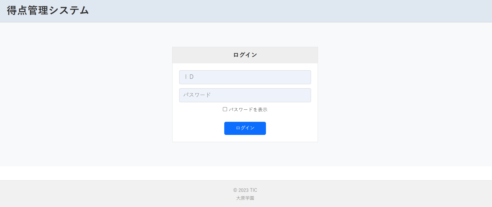
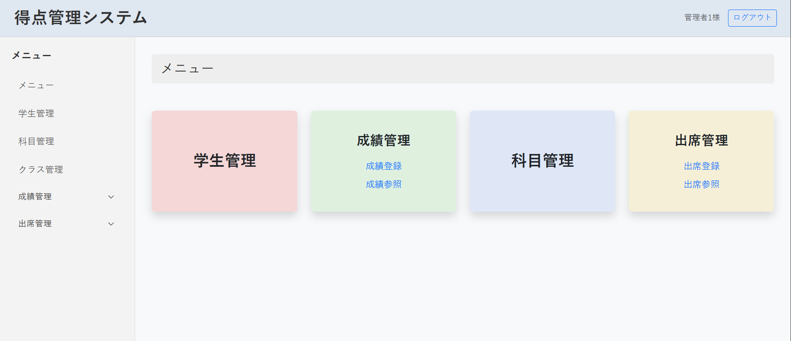
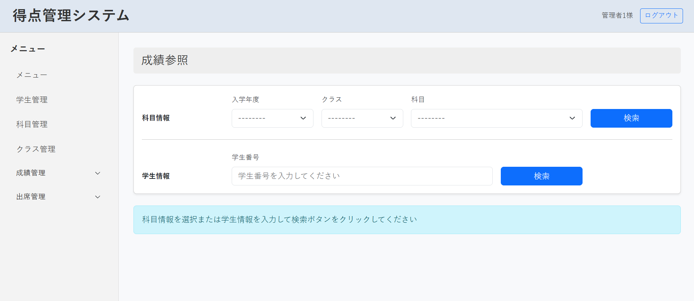

# 学生管理システム (SMS)

Java Servlet / JSP で作成した、教員向けの学生管理Webアプリケーションです。
学生・クラス・科目・成績・出席を管理できます。学校での学習の一環として制作しました。

<!--
スクリーンショットを追加する場合は、docs/screenshots/ に画像を置いて、このコメントを外してください。

## 画面
| ログイン | メニュー | 成績一覧 |
|---|---|---|
|  |  |  |
-->

## 機能

| 分野 | 内容 |
|---|---|
| 認証 | 教員のログイン / ログアウト（セッション管理） |
| 学生管理 | 登録・一覧・更新 |
| クラス管理 | 登録・一覧・更新 |
| 科目管理 | 登録・一覧・更新・削除 |
| 成績管理 | 成績の登録、科目別・学生別の成績一覧 |
| 出席管理 | 出欠の登録、出席一覧、出席履歴 |

## 使用技術

- 言語: Java 21
- Web: Servlet / JSP / JSTL (Jakarta EE)
- サーバー: Apache Tomcat 10
- データベース: H2 (ファイルモード) / JDBC
- 開発環境: Eclipse (Dynamic Web Project)

## 構成

リクエストは `FrontController` が受け取り、URLに対応する `Action` クラスを呼び出します。
`Action` が `DAO` 経由でデータベースを操作し、結果を JSP に渡して画面を表示します。

```
ブラウザ → FrontController (*.action) → Action → DAO → H2
                                          ↓
                                         JSP (JSTL)
```

例: `/sms/auth/Login.action` → `auth.LoginAction` → `auth/login.jsp`

```
src/main/java
├── auth/        ログイン・ログアウト・メニュー
├── student/     学生管理
├── classnum/    クラス管理
├── subject/     科目管理
├── test/        成績登録・成績一覧
├── attendance/  出席管理
├── bean/        データを保持するクラス (Student, Subject, Test など)
├── dao/         データベース操作 (StudentDAO, TestDAO など)
└── tool/        FrontController, Action, EncodingFilter
src/main/webapp
├── *.jsp        画面 (機能ごとのフォルダ)
└── META-INF/context.xml   データソース設定
```

## 動かし方

### 必要なもの
- JDK 21
- Apache Tomcat 10.x
- Eclipse (Enterprise Java and Web Developer)

### 手順
1. データベースを作成します（H2 は `~/exam1` にファイルを作ります）。
   **Tomcat を停止した状態で**、SQL ファイルを流し込んでください。
   ```
   java -cp src/main/webapp/WEB-INF/lib/h2-2.1.214.jar org.h2.tools.RunScript -url jdbc:h2:~/exam1 -user sa -script <SQLファイル名>.sql
   ```
2. Eclipse で `File → Import → Existing Projects into Workspace` からこのフォルダを読み込みます。
3. プロジェクトを右クリックして `Run As → Run on Server` で Tomcat 10 を選びます。
4. ブラウザで `http://localhost:8080/sms/` を開くとログイン画面に移動します。
   ログインには、SQL ファイルに含まれる教員アカウントを使用してください。

> H2 のファイルモードは同時に1つのプロセスしか開けません。
> Tomcat の起動中に別のツールから同じDBを開くとエラーになります。

## 今後の改善

- パスワードのハッシュ化（BCrypt など）
- ログイン確認の共通化（Filter にまとめる）
- 入力チェックの強化と単体テストの追加
